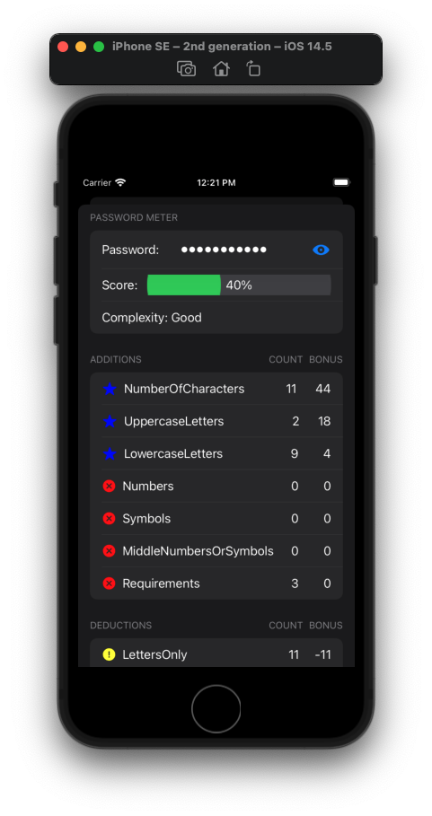

## Projeto - DB1 Start - Refactor PasswordMeter

###  **_Implementation of the brand new refactored back-end from the [PasswordMeter](http://www.passwordmeter.com/) website_**

 **_The main goal was to refactor the back-end logic from javascript to java using and abusing of the concepts:_**

* _Object Oriented Programming_
* _Clean Code_
* _S.O.L.I.D._
* _Tests_

**_Since the back-end was ready, it was easy to convert it to swift and 2 simple views as user interfaces_**

___
___
___
___
___

